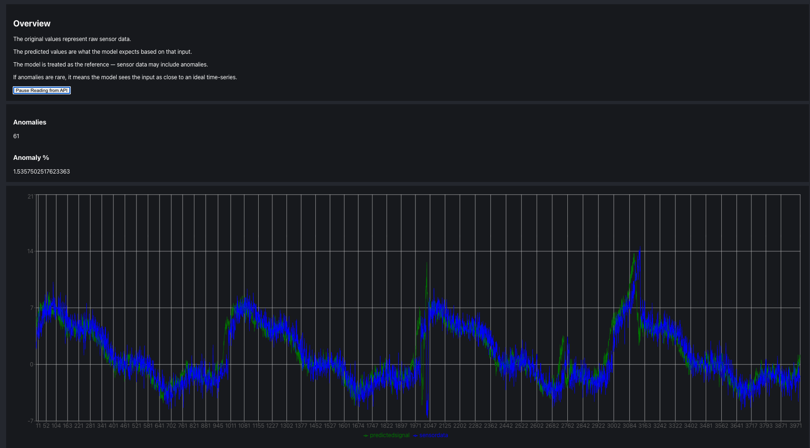

# iot-lstm-pm

A demo that shows how an LSTM model can be used to monitor sensor data over a period of time. Built from scratch.

### Overview

An LSTM (or other) models can be trained on time-series data, that fit to a "steady-state" wave, or a signal that has a healthy state.
When a new signal is generated from the source, the model will take in the reading, attempt to re-create the signal using its own bias.
As a result, we have two waveforms: the original and the forecasted. 

Because the model has been trained to recognize patterns and forecast future cycles from the original "steady-state" waveform,
performing a comparison between the input and what the model has predicted as its output, will provide us with a way to perform an anomaly analysis.

If the error rates when performing the comparisons between the input signal and the model's forecasted waveforms are high, then the model has done a poor job at noticing seasonality, outliers, etc from the input. Thus, our error rate calculations and cross-comparisons will provide us with a good estimate on anomalies present in the input waveform.

### UI Example

### System Overview

### Self-hosted instructions

Make sure you have docker installed with docker compose.

1. Clone this repo
2. Run: `./build-docker.sh` from the root directory. (IF you're on a Windows Machine, just run the docker command explicitly with: `docker compose up --build`)
3. To exit kill the program, just close the terminal or hit Control+C

#### Alternative

You can just use mprocs on your local machine to start up the services. Just run `mprocs` from the root of this directory (make adjustments to the `mprocs.yaml` file if needed)

> This was not generated with AI. Cheers.
