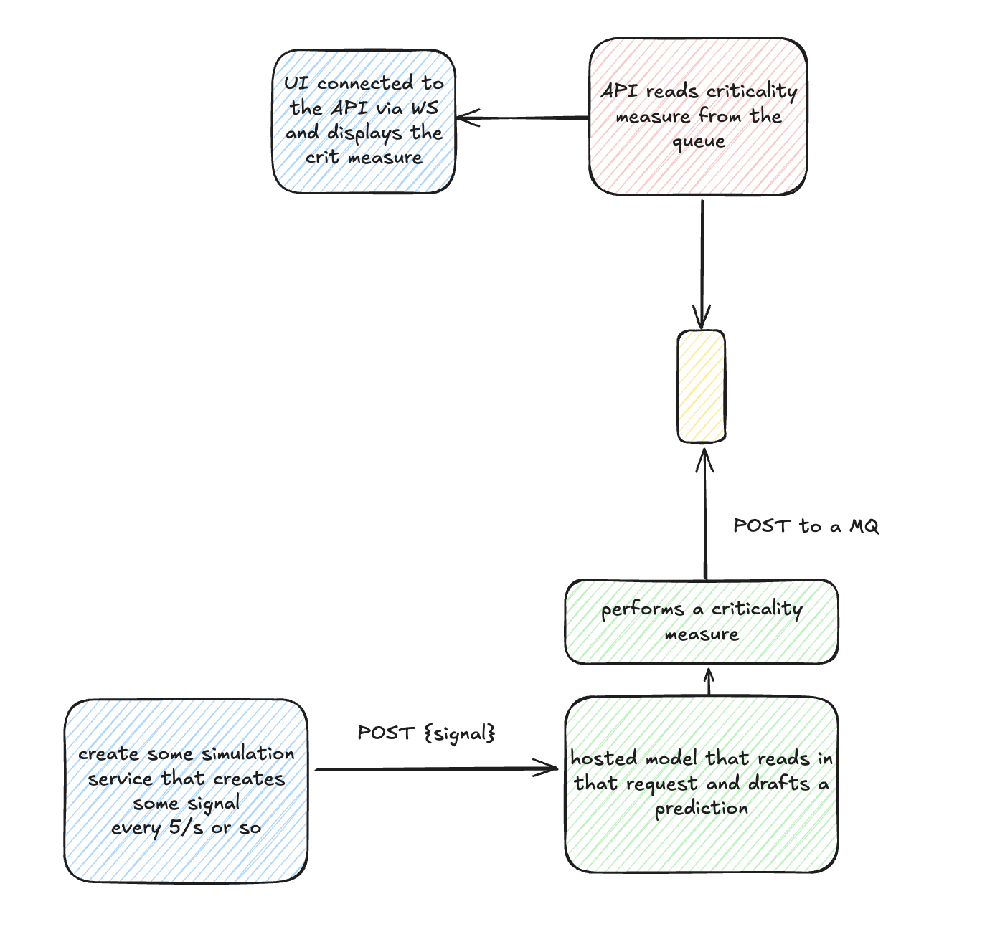

# iot-lstm-pm

A demo that shows how an LSTM model can be used to monitor sensor data over a period of time.

### Self-hosted instructions

Make sure you have docker installed with docker compose.

1. Clone this repo
2. Run: `docker compose up --build` from the root directory.

